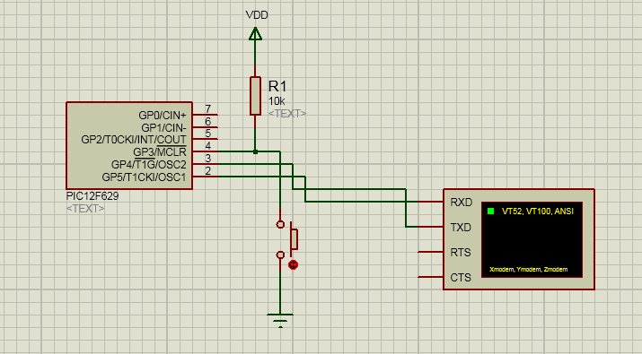

# UART bit-bang

A simple application written for PIC 12F629 microcontroller, demonstrating how to implement a software UART 
solution for asynchronous serial communication.

## Schematic

- GP3: Button
- GP4: RX Line
- GP5: TX Line

In this demo, we have a 8N1 transmission at 300 bps. To send data, press the button on pin GP5.
